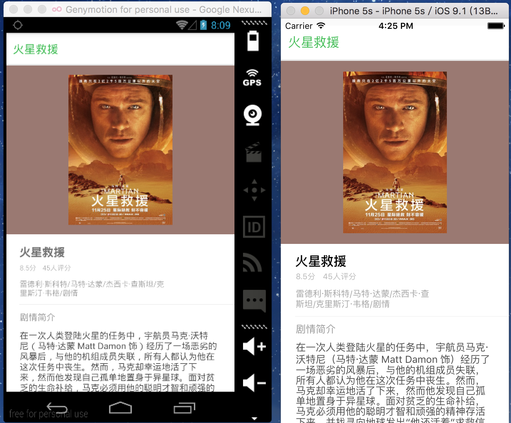

# DoubanMovie-React-Native

## How does it look like ?

  

## How to run ? 

1. [Setup](http://facebook.github.io/react-native/docs/getting-started.html#content) React Native develope environment
2. Clone the project, cd into the root folder
3. Open Terminal and run the following command:   
        `npm install`  
		 `react-native run-android`

## TODO
1. Movie searching
2. Show movie catagories in `DrawerLayoutAndroid`
